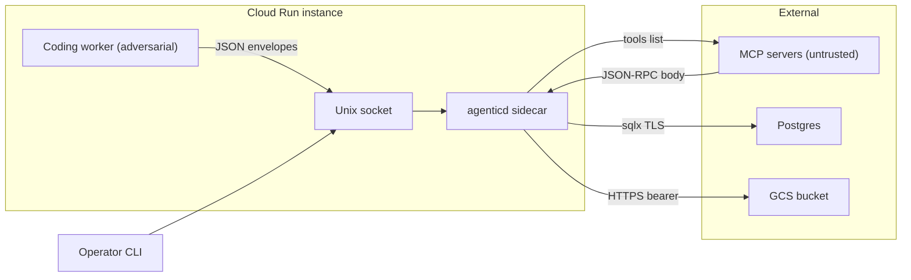

# git.agentic — Threat Model

**Date:** 2026-05-21
**Branch:** `main` @ `2c34898`
**Author:** AppSec sweep (pre flip-to-public)
**Scope basis:** user-confirmed via /security-threat-model assumption gate.
**Revisions:** 2026-07-10 — reconciled rows TM-001/002/003/009, the focus-path table, and the closing notes
with controls that shipped after this model was written
(ADR-0012 `864b5c3`, ADR-0013 `b26777d`, ADR-0014 `beacd65`/#121).
Narrative sections (system model, data flows, abuse paths) still describe the 2026-05-21 state and are kept as the original analysis;
the table rows and closing notes are the live status.
The unrevised original is in git history.

## Executive summary

The dominant risk themes for v1.0 are (1) **trust asymmetry on the daemon's wire surface** — agenticd treats every connection on its Unix socket as fully trusted, but the prioritized ADR-0004 sidecar deployment puts a *fully adversarial* Coding worker on the other end of that socket; (2) **a documented-but-unimplemented control**, the "high-entropy secret scanner" referenced in `CLAUDE.md`/`AGENTS.md`/`docs/architecture/overview.md`, which doesn't exist in code and therefore offers no defense if operators rely on it; and (3) **untrusted MCP server responses** fed into the canonical tools-tree dimension on every commit, with only a 10 s timeout as a brake. The highest-leverage focus areas are `crates/agenticd/src/server.rs`'s request dispatcher, `crates/agenticd/src/mcp.rs`'s fingerprint parser, the rollback `accept_data_loss` path, and the GCS object-store credential handling. *(2026-07-10 revision: themes (1) and (2) are closed — ADR-0012 `SO_PEERCRED` peer auth and the ADR-0013 secret scanner shipped; MCP response caps and URL policy landed via PR #117 + ADR-0016. See the reconciled table rows below.)*

## Scope and assumptions

**In scope** (per user confirmation):
- `crates/agenticd/` — the daemon (sidecar deployment shape per ADR-0004)
- `crates/agentic-core/` — object store, refs, commit, GCS backend
- `crates/agentic-memory/` — Postgres+pgvector adapter
- `crates/agentic-proto/` — wire types, framing
- `crates/agentic-cli/` — only the parts that drive the daemon
- `crates/agenticd/Dockerfile.sidecar` — sidecar packaging

**Out of scope** (deferred / not v1.0):
- `sdk/python/` (consumed by trusted operator code in v1.0)
- `website/`, `examples/langgraph-rollback/` content
- Hosted SaaS deployment
- Multi-tenant daemon, web UI, additional memory backends, additional framework adapters
- v1.1 ephemeral branches, secondary ObjectStore (ADR-0007/0008)

**Assumptions (user-confirmed):**

1. Primary deployment is **ADR-0004 sidecar in Cloud Run**: agenticd container co-located with a "Coding worker" container, sharing a Unix socket and a GCS bucket per tenant.
2. The Coding worker is **fully adversarial**: it runs LLM-driven code that may be prompt-injected by hostile ticket content. Every byte it sends on the socket must be assumed attacker-shaped.
3. MCP server responses are **untrusted by default**: operator configures the MCP URL list, but the response bodies are attacker-controllable.
4. The local operator running `agentic` CLI is trusted; the daemon does not defend against the operator.
5. Daemon does not open a public network listener. Unix socket only; OS-level FS permissions provide the only auth.

**Open questions that would materially change the ranking:**
- Will the sidecar's Unix socket use `SO_PEERCRED`/UID checks to distinguish the trusted operator from the adversarial worker, or do they share a UID? Currently both share the UID inside a single Cloud Run instance (per `docs/integration/executor-sidecar.md`).
- Is the GCS bucket for sessions scoped per-tenant or is one bucket shared across tenants? The `gcs://<your-bucket>/<tenant>` convention suggests shared with tenant prefix — that's IAM-only isolation.
- Is the `DATABASE_URL` for the per-tenant Postgres also shared infra, or per-tenant?

## System model

### Primary components

- **agenticd** (`crates/agenticd/`) — long-lived Rust process; accepts `agentic-proto` JSON envelopes on a Unix socket. One global commit-lock serializes write-path requests (ADR-0001 §process model).
- **Object store** (`crates/agentic-core/src/store.rs`, `gcs_store.rs`) — content-addressed blob/tree/commit store. Two backends: `FsObjectStore` (local fs, demo) and `GcsObjectStore` (Cloud Run sidecar deployment, per ADR-0004 D5). Sync trait; daemon wraps in `spawn_blocking` (PR #55).
- **Postgres adapter** (`crates/agentic-memory/src/postgres.rs`) — memory snapshot capture, segment manifest write, reverse migrations. Connects via `DATABASE_URL`.
- **MCP fingerprinter** (`crates/agenticd/src/mcp.rs`) — issues `tools/list` JSON-RPC to every configured MCP server on every commit; canonicalizes responses; commits a fingerprint per server. Bounded concurrency = 8 (`FINGERPRINT_CONCURRENCY`).
- **Rollback path** (`crates/agenticd/src/rollback/`) — restores prompts tree to disk, applies reverse migrations, write-back via `write_blob_safely`. `accept_data_loss` flag wired through `migrate::run_reverse`.
- **CLI** (`crates/agentic-cli/`) — operator-facing; runs subprocess `git rev-parse HEAD` once at commit time with fixed args.
- **Sidecar packaging** (`crates/agenticd/Dockerfile.sidecar`) — rustls-only, no OpenSSL, non-root UID 65532.

### Data flows and trust boundaries

- **Sibling worker (adversarial)** → **agenticd** via Unix socket: length-prefixed JSON envelopes (`agentic-proto/src/framing.rs`, 16 MiB frame cap). Auth: FS permissions only; no `SO_PEERCRED`. Validation: `serde_json` for envelope shape; **no per-Request structural validation, no Hash strict format check until consumed, no per-operation rate limit, no auth token.**
- **agenticd** → **Postgres** via TCP+TLS: `sqlx` runtime-tokio-rustls. Credentials in `DATABASE_URL`. SQL written as parameterized queries on the snapshot/migration path; one `format!(...)` for advisory-lock helpers (low-risk, no untrusted input).
- **agenticd** → **MCP server (untrusted)** via HTTPS: `reqwest` rustls; 10 s per-server timeout; up to 8 in flight; response is parsed as JSON-RPC, canonicalized (sorted keys, no whitespace) before BLAKE3 hash. **Response body size is not explicitly bounded** beyond reqwest's defaults.
- **agenticd** → **GCS** via HTTPS: rustls; bearer token from operator-supplied config/env. Object-key namespace is operator-controlled per-tenant prefix. **No additional encryption at rest beyond GCS default; no key separation between tenants if the bucket is shared.**
- **agenticd** → **repo filesystem** at `<repo>/.agentic/refs/`, `<repo>/prompts/` during rollback. Path-traversal mitigations: `validate_tree_entry_name` rejects non-Normal components, `write_blob_safely` checks symlinks + temp-then-rename (`crates/agenticd/src/rollback/writeback.rs`, A4/PR #51).
- **Operator** → **agenticd** via Unix socket: same channel as the worker; same trust model. (In sidecar shape, distinguishing operator from worker is the open IAM question.)

#### Diagram

## Assets and security objectives

| Asset | Why it matters | Security objective |
|---|---|---|
| Tuple snapshots in object store (Commit blobs, manifests, prompts trees) | The product's value proposition is honest rollback; tampering destroys integrity guarantees | Integrity (high), confidentiality (medium — contains prompts/code) |
| Memory snapshots (segment manifests + pgvector blobs) | May contain customer-derived content embedded as vectors; rollback restoration touches live DB | Confidentiality (high), integrity (high) |
| GCS bearer token | Grants R/W on the tenant's snapshot bucket | Confidentiality (critical — token theft = unbounded read/write to bucket) |
| `DATABASE_URL` (with password) | Direct DB access if leaked | Confidentiality (critical) |
| Postgres `agentic_change_log` table + adapter state | Source of memory dimension; tampering corrupts snapshot honesty | Integrity (high) |
| Prompts on disk (`<repo>/prompts/`) | Restored from rollback; symlink/race surface | Integrity (high), availability (medium) |
| `agenticd` process availability | One sidecar per worker; if it stalls, the worker fails the ticket loudly (ADR-0004 D4) | Availability (high in sidecar deployment; medium in demo) |
| GCS bucket compute / egress cost | DoS via amplified writes | Availability (medium — cost-DoS) |

## Attacker model

### Capabilities

- **Sibling worker (in sidecar shape):** can open arbitrary connections to the Unix socket; can craft arbitrary `Request` payloads up to 16 MiB; can call any operation (Ping, Commit, Rollback with `accept_data_loss=true`, Log, Diff, ReadObject, ResolveRef); shares the same UID and filesystem mount as agenticd; can read any file agenticd can read (including the GCS bearer token if loaded into env or files).
- **MCP server operator (network-adjacent or compromised dependency):** returns malicious JSON-RPC `tools/list` responses; can withhold response to consume the 10 s timeout; can return oversized payloads up to reqwest's body limit; can return responses designed to inflate canonicalization cost.
- **Network-positioned attacker (between agenticd and GCS or Postgres):** TLS is rustls with system trust store, so passive eavesdropping is not feasible without a CA compromise; active MITM requires a trusted cert. Lower-likelihood capability.
- **Operator on the local Docker-compose demo:** trusted (out of attacker scope per assumption 4).

### Non-capabilities

- Cannot open a public listener on the daemon (no TCP bind path — `UnixListener` only in `crates/agenticd/src/main.rs:131`).
- Cannot escalate UID inside the container (assumes the Dockerfile's `useradd ... uid 65532` is respected by orchestrator; relies on Cloud Run not granting root).
- Cannot directly modify Postgres on disk (separate service, separate IAM).
- Cannot rewrite GCS objects in place — GCS objects are content-addressed by hash; overwrite requires the original cleartext to forge a matching hash. (Trust in BLAKE3 collision resistance.)

## Entry points and attack surfaces

| Surface | How reached | Trust boundary | Notes | Evidence |
|---|---|---|---|---|
| Unix socket dispatcher | Sibling worker / operator | Worker → daemon | All seven `Request` variants; one global commit-lock; no auth beyond FS perms | `crates/agenticd/src/server.rs:148` (`dispatch`) |
| `Request::Commit` | Worker writes a `CommitInput` | Worker → daemon | Triggers memory snapshot, MCP fingerprint, 2PC stage; takes commit-lock | `crates/agenticd/src/commit.rs:46` (`execute`) |
| `Request::Rollback` | Worker writes a `RollbackArgs` | Worker → daemon | Path-traversal-checked; **`accept_data_loss=true` triggers destructive down-migrations** | `crates/agenticd/src/rollback/mod.rs` |
| `Request::ReadObject` | Worker requests any hash | Worker → daemon | Returns full object bytes (10 MiB cap); enables tuple-state exfiltration | `crates/agenticd/src/server.rs:199` |
| MCP `tools/list` egress | Operator-configured MCP URL list | Daemon → untrusted server | Response parsed as JSON-RPC, canonicalized, hashed; 10 s timeout | `crates/agenticd/src/mcp.rs:98` (`fingerprint_one`) |
| GCS object store | Daemon issues HTTPS to bucket | Daemon → cloud | Bearer auth; rustls; no additional encryption-at-rest | `crates/agentic-core/src/gcs_store.rs` |
| Reverse migrations | Driven by `Rollback` request | Worker → daemon → Postgres | Outer-tx atomic per A8; `accept_data_loss` bypasses IRREVERSIBLE check | `crates/agenticd/src/migrate.rs`, A8 |
| Prompts write-back during rollback | `restore_prompts` writes to `<repo>/prompts/` | Daemon → filesystem | Tree-entry name validated; symlink unlink + temp-rename (A4) | `crates/agenticd/src/rollback/writeback.rs:55,71` |
| `git rev-parse HEAD` subprocess | CLI commit path | Operator → CLI | Fixed args, `current_dir(repo)`, no shell, no user-input concat — low risk | `crates/agentic-cli/src/main.rs:463` |

## Top abuse paths

1. **Worker exfiltrates tuple history without authorization.** Worker enumerates branch refs via `Request::ResolveRef`, then issues `Request::ReadObject` for each commit hash. ReadObject returns raw bytes for any object up to 10 MiB. **Impact:** complete read of every prompt, manifest, and Commit blob the daemon has access to — including past tenants' content if the GCS bucket and Postgres are not strictly per-tenant-isolated.
2. **Worker corrupts production schema via Rollback + `accept_data_loss=true`.** Worker constructs a `Rollback` request targeting an old commit with an IRREVERSIBLE migration, sets `accept_data_loss=true`, and the daemon executes the destructive down-migration inside the outer transaction. **Impact:** production data loss; Postgres state diverges from any honest snapshot.
3. **Worker stages forged Commit dimensions.** Worker calls `Request::Commit` with attacker-shaped `prompts` and `tools` content, no_memory=true to skip the Postgres path. The commit lands honestly on the branch ref. **Impact:** integrity break — the recorded commit history contains attacker content presented as the worker's "honest" tuple state. (Same vector if MCP servers are untrusted: a malicious MCP response gets canonicalized and committed.)
4. **Worker DoS via commit-lock starvation.** Worker pipelines `Commit` requests faster than they can drain; each holds the global commit-lock for the full 2PC sequence. **Impact:** legitimate workers fail their tickets loudly (ADR-0004 D4) — denial of service.
5. **Malicious MCP server poisons the tools-tree dimension.** Operator-configured MCP server returns a `tools/list` JSON containing crafted entries; the canonicalizer produces deterministic bytes; the BLAKE3 fingerprint commits attacker content into the tools dimension. **Impact:** integrity break on the tools tuple element; downstream rollback restores attacker content.
6. **Malicious MCP server triggers parser exhaustion / slowloris.** Server returns a deeply nested JSON or stalls past the 10 s timeout. With 8-way concurrency, eight in-flight MCP commits stall the parallel pool. **Impact:** commit latency inflation; per-commit cost increase.
7. **GCS bearer token exfiltration via env / file read.** Token is supplied via operator config; if loaded into a process env or world-readable file, a hostile worker sharing the UID and mount can read it (`/proc/self/environ`, etc.). **Impact:** full R/W on tenant GCS bucket, including overwriting other tenants' object keys if the bucket isn't per-tenant.
8. **Path-traversal via crafted Commit prompts tree.** Worker stages a Commit with a Tree entry name that bypasses `validate_tree_entry_name` (e.g., normal-form Unicode tricks, or a name that's "Normal" to Rust's PathBuf but reinterprets on the host filesystem). On rollback, `restore_prompts` writes outside `<repo>/prompts/`. **Impact:** arbitrary file write as the agenticd UID. (Existing mitigation is the path-component validator; gap is non-ASCII normalization.)
9. **Operators commit secrets relying on the documented-but-absent scanner.** Operator reads CLAUDE.md/AGENTS.md/overview.md, configures prompts containing live API tokens, expects the scanner to reject the blob. The scanner does not exist; blob lands in the object store and (in the sidecar) in GCS. **Impact:** secret leakage to a long-lived content-addressed object store.
10. **Postgres `DATABASE_URL` leak via logs / process listing.** `tracing::info!` paths or panic messages in the adapter could format the URL into output. (Spot check shows no obvious leak, but the URL is passed through `PgConfig` without redaction.) **Impact:** credential exfiltration if logs are shipped to a less-secure system.

## Threat model table

| Threat ID | Threat source | Prerequisites | Threat action | Impact | Impacted assets | Existing controls (evidence) | Gaps | Recommended mitigations | Detection ideas | Likelihood | Impact severity | Priority |
|---|---|---|---|---|---|---|---|---|---|---|---|---|
| TM-001 | Sibling worker | Reachable Unix socket; shares UID | `ReadObject` enumeration to dump tuple history | Confidentiality break across tenant tuple state | Tuple snapshots, memory snapshots | `SO_PEERCRED` UID allowlist at accept — `--allowed-uid`, fail-closed startup ([ADR-0012](docs/adr/0012-socket-peer-authentication.md), `864b5c3`, `main.rs`); per-UID connection/rate admission control (issue #118, `limits.rs`); 10 MiB per-response cap (`server.rs`); object-keys are content-addressed | No per-operation authz — an allowlisted UID can call every `Request` variant; `SO_PEERCRED` negative paths are Linux-CI-only (macOS uses `getpeereid`) | ~~Require `SO_PEERCRED`-derived UID match~~ **shipped** (ADR-0012); rate-limit ~~ReadObject~~ **shipped** (#118). Remaining if the worker must be read-limited: per-operation auth-token capability | Audit-log every ReadObject with peer credential; alert on rate spike | high | high | ~~**critical**~~ **closed by ADR-0012** (2026-07-10 reconciliation) |
| TM-002 | Sibling worker | Reachable Unix socket | `Rollback` with `accept_data_loss=true` against IRREVERSIBLE down-migration | Production data loss | Postgres state | Approval gate ([ADR-0014](docs/adr/0014-destructive-rollback-approval-gate.md), `beacd65`/#121): `accept_data_loss=true` rejected unless a signed approval token bound to the requesting peer UID is presented; fail-closed without `--approval-key-file`, no override flag; structured `RollbackForcedDataLoss` audit event; A8 outer-tx atomicity (`migrate::run_reverse`) | Approval-key custody is an operator responsibility outside the daemon | ~~Require an out-of-band operator approval + audit event~~ **shipped** (ADR-0014) | Alert on every `accept_data_loss=true` commit; correlate `RollbackForcedDataLoss` with ADR-0012 peer-UID audit lines | medium | high | ~~**high**~~ **closed by ADR-0014** (2026-07-10 reconciliation) |
| TM-003 | Sibling worker | Reachable Unix socket | Craft `CommitInput` with hostile prompts/tools bytes, no_memory=true | Integrity break: forged tuple recorded as honest snapshot | Tuple snapshots, branch refs | `SO_PEERCRED` allowlist at accept + peer-UID stamped on every Commit (`commit.rs`, threaded from the ADR-0012 dispatch context); frame size cap (16 MiB); commit-lock serializes | No daemon-signed attestation beyond the peer UID; an allowlisted worker can still stage hostile content as its own honest state | ~~Tag commits with peer-UID at the daemon side~~ **shipped** (ADR-0012). Remaining: attestation field signed by the daemon's run identity, if stronger provenance is needed | Diff agent_id field against historical pattern; alert on mismatch | high | medium | ~~**high**~~ **largely closed by ADR-0012** (2026-07-10); residual = attestation depth |
| TM-004 | Sibling worker | Reachable Unix socket | Pipeline `Commit` to hold commit-lock | DoS — worker tickets fail | Daemon availability | Single commit-lock; LocalSet single-threaded | No per-peer rate limit; no max-in-flight | Add per-peer queue depth and a request-rate cap; surface lock-wait metric so saturation is detectable | Lock-wait latency histogram; alert on p99 > N | medium | medium | **medium** |
| TM-005 | Hostile MCP server | Operator-configured URL; HTTPS reachable | `tools/list` returns adversarial canonicalizable payload | Integrity break on tools dimension | Tuple snapshots (tools sub-tree) | Per-call 10 s timeout (`mcp.rs:84`); 8-way concurrency cap | No response body size cap beyond reqwest default; no schema validation of the JSON-RPC result; no allowlist of "trustworthy" MCP servers | Add explicit response-body byte cap (e.g., 1 MiB) before parsing; schema-validate `result.tools` shape; allow operator to mark MCP servers `trusted` vs `untrusted` and behave differently | Log canonical size + JSON depth; alert on outliers | medium | medium | **medium** |
| TM-006 | Hostile MCP server | Operator-configured URL | Return slowly, exhaust 10 s; pipeline across all 8 slots | Per-commit latency inflation; cost | Daemon availability | 10 s timeout caps per-call; bounded concurrency | All-malicious server set fully drains the pool every commit | Add per-server failure backoff (skip a failing server for N minutes); make MCP optional on commit if non-blocking is acceptable | Alert on per-server timeout rate | medium | low | **low** |
| TM-007 | Sibling worker (shared UID) | Process can read agenticd's env or config files | Read GCS bearer token, exfiltrate or overwrite bucket | Confidentiality + integrity of all per-tenant GCS data | GCS bearer token, bucket contents | rustls-only; non-root UID 65532; sidecar uses GCS workload identity if configured | If token is in env / file, worker UID can read it | Use GCS workload-identity / metadata-server tokens (short-lived, audience-scoped) rather than static bearer; never write token to disk or env; if static, use Linux capability separation between worker and sidecar | Audit GCS access logs for unexpected source identity | medium | high | **high** |
| TM-008 | Sibling worker | Reachable Unix socket | Stage `Commit` with crafted prompts tree name designed to bypass `validate_tree_entry_name` (Unicode, NFC/NFD normalization) | Arbitrary write inside repo dir as daemon UID | Filesystem outside `prompts/` | `validate_tree_entry_name` rejects non-`Normal` components; `write_blob_safely` symlink-checks (A4) | Validator is `PathBuf::Normal` based; doesn't normalize Unicode; no canonicalize-then-prefix-check | Add canonicalize+prefix-startswith check against the repo's prompts dir; reject any name containing `/`, backslash, NUL, control chars, or non-NFC-normal Unicode | File-system audit log for writes outside `prompts/`; FIM | low | high | **medium** |
| TM-009 | Operator (mistakenly relying on docs) | Operator commits a blob containing a live API token | Secret lands in object store / GCS / Postgres unredacted | Credential leak | Object store, GCS | Scanner enforced at `put_raw` ([ADR-0013](docs/adr/0013-secret-scanner.md), `b26777d`, 2026-05-21): pattern + entropy detectors, typed `SecretDetected` hard-reject, blob-hash allowlist (D4); [ADR-0017](docs/adr/0017-entropy-exemption-for-checkpoint-paths.md) exempts only the entropy heuristic under declared checkpoint prefixes — pattern rules always run | Commit/Tree metadata bypasses the scanner (SEC-002/005, open) | ~~Option A: build the scanner~~ **shipped** (ADR-0013 — Option A was taken). Residual: extend coverage to the metadata path (SEC-002/005) | Log every reject; surface count in `agentic` CLI | high (when operators trust docs) | high | ~~**critical**~~ **closed by ADR-0013** (2026-05-21; reconciled 2026-07-10) |
| TM-010 | Logs handler / panic path | Adapter logs `PgConfig` or panic message; logs ship somewhere less secure | `DATABASE_URL` with password printed | Credential leak | Postgres password | sqlx errors do not by default include the URL | `PgConfig` is `Debug`-derived (`postgres.rs:51`); a `tracing::debug!("{:?}", cfg)` anywhere would print it; no `Redact` on the field | Implement custom `Debug` for `PgConfig` redacting password; add unit test asserting `format!("{cfg:?}")` does not contain password | Static analysis or grep for `{:?}` on PgConfig | low | high | **medium** |

## Criticality calibration

- **Critical (act before flipping public):** an exploitable abuse path that breaks the product's stated integrity guarantee, or leaks a documented invariant. Examples: TM-001 (worker reads any object → cross-tenant exfil if shared infra), TM-009 (operators rely on a scanner that doesn't exist and commit secrets).
- **High:** abuse paths whose impact is significant but require a less-trivial precondition (operator misconfig, hostile MCP curation, shared-UID assumption). Examples: TM-002 (destructive rollback requires explicit flag), TM-003 (integrity forgery requires sustained access), TM-007 (token theft requires shared-UID read).
- **Medium:** abuse paths whose impact is bounded or recoverable without data loss. Examples: TM-004 (DoS is loud per ADR-0004), TM-005 (committed bad tools tree is detectable via diff), TM-008 (path traversal mitigation is mostly intact; gap is Unicode edge cases), TM-010 (credential-in-log is a hygiene gap, not a current exploit).
- **Low:** noisy DoS with easy mitigation, low-sensitivity info leaks. Example: TM-006 (MCP slowloris is annoying but not data-damaging).

## Focus paths for security review

| Path | Why it matters | Related Threat IDs |
|---|---|---|
| `crates/agenticd/src/server.rs` (`dispatch`, `DaemonState`) | Single entry point for every adversarial request; no auth/authz layer | TM-001, TM-002, TM-003, TM-004 |
| `crates/agenticd/src/main.rs` (socket bind + accept loop) | The `SO_PEERCRED` / peer-UID check lives here (ADR-0012, shipped) | TM-001, TM-003 |
| `crates/agenticd/src/commit.rs` | `execute` orchestrates the 2PC; peer-UID tagging lives here (ADR-0012, shipped); a signed attestation field would too | TM-003 |
| `crates/agenticd/src/rollback/mod.rs` + `migrate.rs` | `accept_data_loss` flag, reverse migration outer-tx (A8) | TM-002 |
| `crates/agenticd/src/rollback/writeback.rs` | Path-traversal defense surface; Unicode normalization gap | TM-008 |
| `crates/agenticd/src/mcp.rs` (`fingerprint_one`) | Untrusted response parsing; no body-size cap; no schema check | TM-005, TM-006 |
| `crates/agentic-core/src/gcs_store.rs` | Bearer token handling, GCS request authorization | TM-007 |
| `crates/agentic-memory/src/postgres.rs` (`PgConfig` Debug) | Credential-in-logs hygiene | TM-010 |
| `crates/agentic-core/src/store.rs` (`put_raw`) | The secret scanner pre-hook is enforced here (ADR-0013, shipped) | TM-009 |
| `CLAUDE.md`, `AGENTS.md`, `docs/architecture/overview.md` §5 | Formerly the source of the unimplemented-scanner claim; the scanner shipped (ADR-0013) and the docs now match the code | TM-009 |
| `crates/agentic-proto/src/lib.rs` + `framing.rs` | Wire-protocol schema and frame cap; site for per-Request structural validation | TM-001, TM-003 |
| `crates/agenticd/Dockerfile.sidecar` | Confirms non-root UID; place to assert capability drops, read-only rootfs | TM-007 |

## Notes on use

- This model assumes the v1.0 sidecar shape is the production target and uses **fully adversarial sibling worker** as the design constraint. If the deployment posture changes (e.g., the worker is later treated as trusted), TM-001/TM-002/TM-003 downgrade significantly and the focus shifts back to MCP and GCS surfaces.
- The single highest-leverage action was **TM-009**: implement the scanner or scrub the claim, before the repo flips public.
  **Done** — the scanner shipped 2026-05-21 ([ADR-0013](docs/adr/0013-secret-scanner.md), `b26777d`), Option A taken; residual coverage gap is the Commit/Tree metadata path (SEC-002/005).
- The second highest-leverage action was **TM-001 + TM-003**: `SO_PEERCRED` socket auth + peer-UID stamping on Commits.
  **Done** — shipped 2026-05-21 ([ADR-0012](docs/adr/0012-socket-peer-authentication.md), `864b5c3`), later hardened by issue #118 admission control; residual is per-operation authz and daemon-signed attestation.
- Rows TM-004 (per-peer rate limits — issue #118 shipped queue-depth and rate caps) and TM-005 (MCP body caps + HTTPS-only URL policy — PR #117 and [ADR-0016](docs/adr/0016-mcp-url-policy.md)) also appear partially or fully addressed, but were **not** reconciled in the 2026-07-10 pass; verify and reconcile them in a follow-up.
